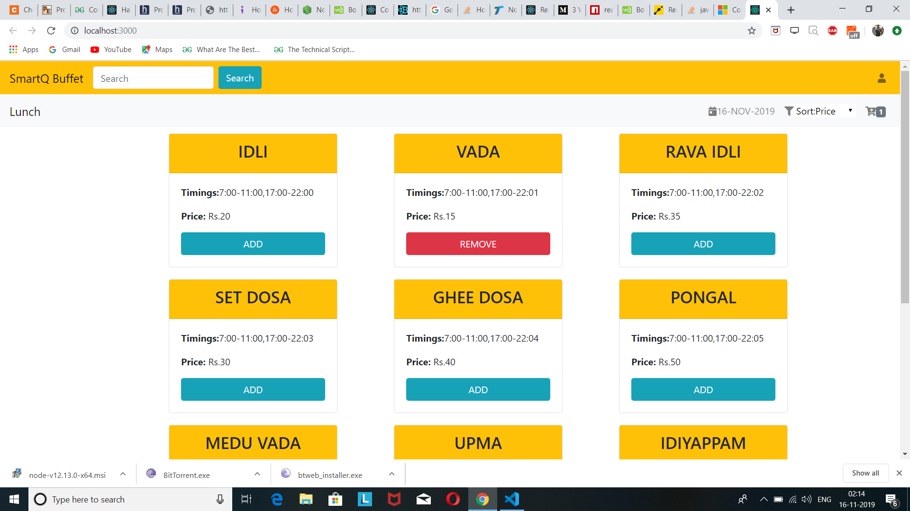
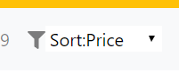
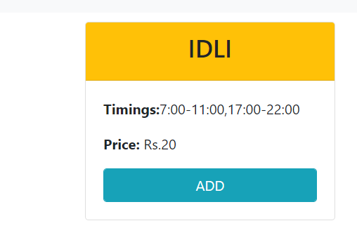
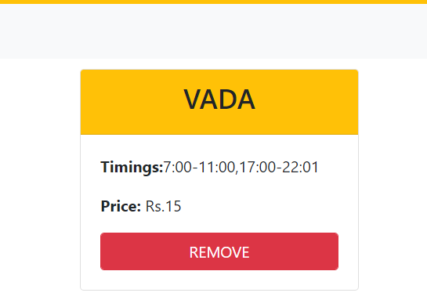
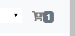
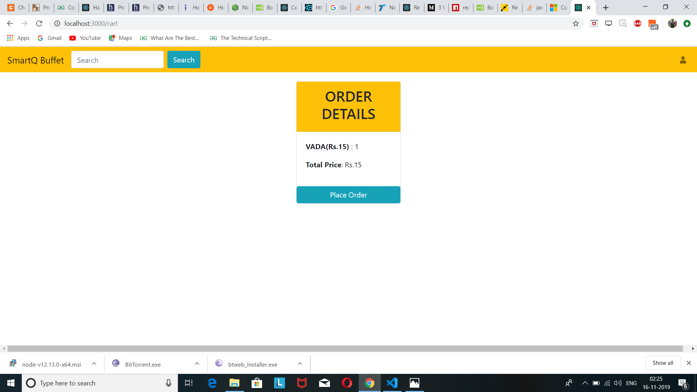

# FoodApp
A simple food app developed in react, you can view all the buffet available , sort buffet according to price , add or remove buffet to cart.

1)View all the buffet available.

2)Sort buffet according to price.

3)Add buffet to cart.

4)Remove buffet to cart.

5)View cart.

